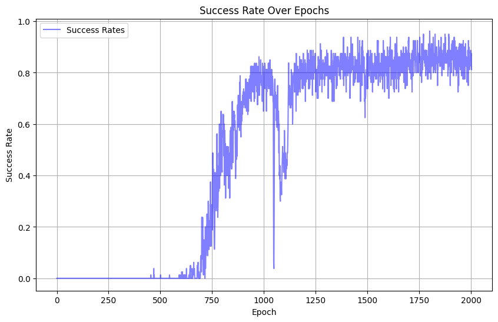

# DDPG+Hindsight Experience Replay

[Hindsight Experience Replay](https://arxiv.org/abs/1707.01495). 

## 초기설정

### Requirements
- python==3.11
- Mujoco 2.3.7
- python=3.5.2
- openai-gym=0.12.5 
- mpi4py == 3.1.4
- gym == 0.26.2
- Gymnasium == 0.29.1
- gymnasium-robotics == 1.2.4
- numpy == 1.26.4 
- torch == 2.3.0

### mujoco 환경 설정 필요 파일
- fetch_env.py
>  target sampling, object sampling시 필요.

repo/fetch_env.py의 내용을 
/home/username/.conda/envs/RLP/lib/python3.11/site-packages/gymnasium_robotics/envs/fetch/fetch_env.py
에 붙여넣어야함.
- pick_and_place.xml
> 환경 초기세팅(table, objects) 

repo/pick_and_place.xml의 내용을 
/home/daehun/.conda/envs/RLP/lib/python3.11/site-packages/gymnasium_robotics/envs/assets/fetch/pick_and_place.xml

## 모델 학습
train pick and place v2
`mpirun -np 8 python -u train.py`

## 모델 테스트
1. 테스트하고자 하는 모델폴더 및 파일(submitFirst/model.pt)를 /repo/saved_models에 저장한다.
2. 모델폴더를 인자(--save-file)로 파이썬 파일 실행.

`python demo.py --save-file submitFirst`

## 학습결과
 2000 epoch동안 학습시 success rate

### big border
<video width="320" height="240" controls>
  <source src="https://github.com/AIE4003/Ultron/blob/1056b8c7a18644bcfabfe051e4779809e182583c/figures/8m52soutput.mp4" type="video/mp4">
  Your browser does not support the video tag.
</video>

### small border
<video width="320" height="240" controls>
  <source src="[https://github.com/AIE4003/Ultron/blob/1056b8c7a18644bcfabfe051e4779809e182583c/figures/smalloutput.mp4](https://github.com/AIE4003/Ultron/blob/1056b8c7a18644bcfabfe051e4779809e182583c/figures/smalloutput.mp4)" type="video/mp4">
  Your browser does not support the video tag.
</video>

